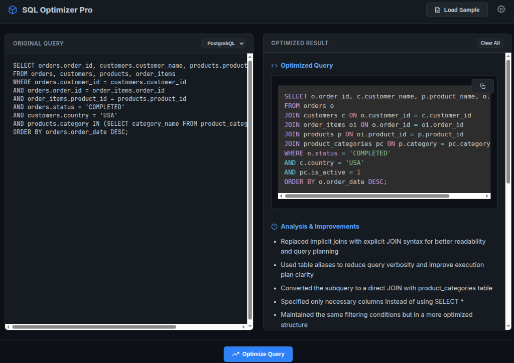

# SQL Optimizer Pro 🚀

A professional, AI-powered SQL query optimization tool designed for developers and DBAs. This tool uses LLMs (via OpenRouter) to analyze your SQL queries and provide structured, production-ready optimizations.

**Live Demo: [https://bigknoxy.github.io/sqlOptimizer/](https://bigknoxy.github.io/sqlOptimizer/)**



## 🌟 Features

- **Expert Analysis**: Leverages Devstral-2512 to act as a Senior DBA.
- **Multi-Dialect Support**: Supports PostgreSQL, MySQL, and SQL Server.
- **Structured Feedback**:
  - Optimized SQL query with syntax highlighting.
  - Bulleted list of performance improvements.
  - Recommended `INDEX` statements.
  - Detailed technical explanation.
- **SaaS Aesthetic**: Modern, dark-themed UI built with vanilla technologies.
- **Privacy First**: API keys are stored locally in your browser's `localStorage`.
- **Zero Build**: Single HTML file deployment.
- **Pro Error Handling**: Beautiful modals for API errors, rate limits, and authentication issues.

## 🚀 Getting Started

### 1. Get an OpenRouter API Key
1. Go to [OpenRouter.ai/keys](https://openrouter.ai/keys).
2. Create a free account or sign in.
3. Generate a new API key.
4. Copy the key (it starts with `sk-or-v1-...`).

### 2. Launch the Tool
Simply open the `index.html` file in any modern web browser.

### 3. Configuration
1. Click the **Settings** (gear) icon in the top right.
2. Paste your OpenRouter API key.
3. Click **Save Settings**.

### 4. Optimize
1. Paste your suboptimal SQL query in the left panel.
2. Select your database dialect.
3. Click **Optimize Query**.

## 📝 Example Queries to Test

### Suboptimal Join & Subquery
```sql
SELECT orders.order_id, customers.customer_name
FROM orders, customers
WHERE orders.customer_id = customers.customer_id
AND customers.city IN (SELECT city_name FROM locations WHERE region = 'North')
```

### Missing Indexes & Select *
```sql
SELECT * FROM users WHERE email = 'test@example.com' AND last_login > '2023-01-01'
```

## 🛠 Tech Stack

- **Frontend**: Vanilla HTML5, CSS3 (Custom SaaS Design), ES6+ JavaScript.
- **AI**: [OpenRouter API](https://openrouter.ai/) (Mistral Devstral-2512).
- **Libraries**: [Prism.js](https://prismjs.com/) (Syntax Highlighting).

## 📦 Deployment to GitHub Pages

1. Create a new repository on GitHub.
2. Upload `index.html`, `screenshot.png`, and `.gitignore`.
3. Go to **Settings > Pages**.
4. Select `main` branch as the source and click **Save**.
5. Your tool will be live at `https://<your-username>.github.io/<repo-name>/`.

## 📄 License

This project is open-source and available under the MIT License.
